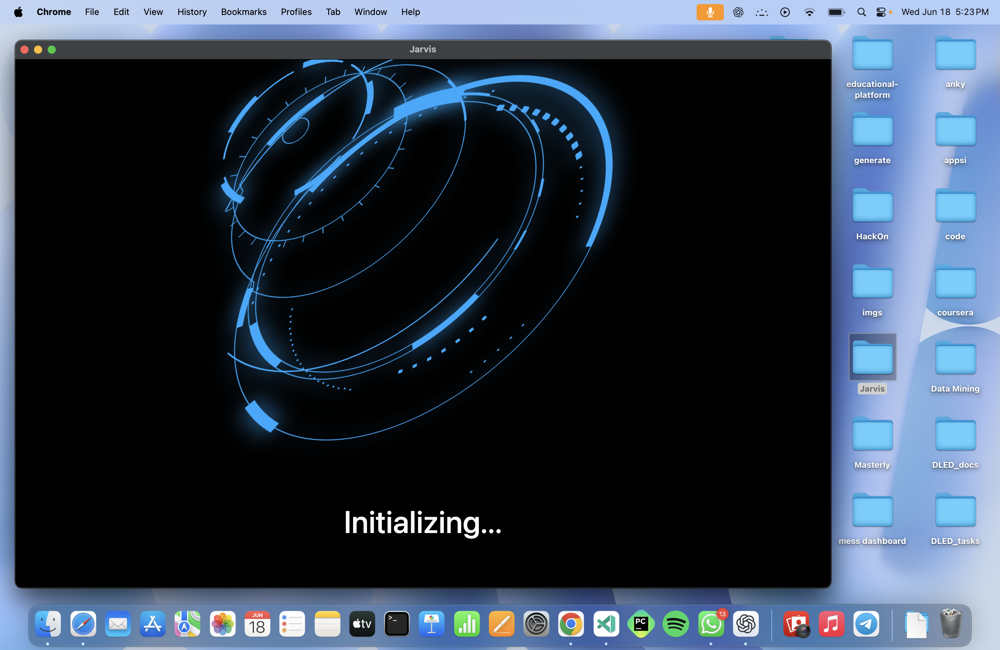

# 🤖 Project Jarvis

Jarvis is a **voice-activated AI assistant for macOS**, built to simplify your digital life through seamless voice interaction. With a sleek UI, advanced capabilities, and powerful integrations like **ChatGPT-4o Mini**, Jarvis brings intelligent assistance to your fingertips—literally and vocally.

---

## 📸 Demo


*Interactive UI of Jarvis on startup.*


*Highly accurate face recognition for secure access.*


*Voice-command and chat based.*


*Voice and text both as output, multitasking in real time.*

---

## 🧠 Features

- 🎙 **Voice Commands**: Launch apps, play music, search the web, and more—just by speaking.
- 💬 **AI Chat**: Powered by ChatGPT-4o Mini to handle complex questions and conversations.
- 📞 **Communication**: Supports voice calls, video calls, messaging, and even WhatsApp interactions.
- 😄 **Interactive UI**: Friendly greetings and animations enhance user experience.
- 🔐 **Face Unlock**: Highly accurate facial recognition for secure access.
- 🧾 **Chat History**: Retains your previous conversations for context continuity.
- 💻 **Mac Integration**: Tailored for macOS systems with native app handling.

---

## ⚙️ Technologies Used

### Frontend
- **HTML** / **CSS** / **JavaScript** – Responsive and interactive UI.

### Backend
- **Python** – Voice processing, app control, AI interaction.
- **MySQL** – Chat history and user data storage.
- **ChatGPT-4o Mini** – Natural language understanding and response generation.

---

## 🚀 Getting Started

> Note: This project currently supports **macOS only**.

### Prerequisites
- Python 3.9+
- MySQL Server
- macOS system with microphone and webcam
- Required Python libraries (listed in `requirements.txt`)

### Installation

1. Clone the repository:
   ```bash
   git clone https://github.com/ankit211275/Jarvis.git
   cd Jarvis

2. Install dependencies:
    ```bash
    pip install -r requirements.txt

3. Configure your MySQL credentials in the jarvis.db file.

4. Add contacts.csv file in the root directory having your personal contacts(You can     fetch from Google contacts)

5. For using the ChatGPT you need to have your API key.

6. For the face recognition you need to run:
        engine/auth/sample.py : to click your face samples
        engine/auth/train.py : to train the model with your face

7. Run the app:
    python run.py

👥 User Feedback

“Jarvis is like having Iron Man tech on your Mac! Voice commands work flawlessly and the UI is really cool!”
— A classmate & user

“Face unlock and WhatsApp messaging and calls via voice while keep working? Mind blown.”
— Early adopter


## 🤝 Contributing

Have ideas or want to help improve Jarvis? Contributions are welcome! Feel free to fork the repo and submit a pull request.

## 🙌 Acknowledgments
	•	OpenAI for ChatGPT-4o Mini
	•	Face recognition and speech recognition Python libraries
	•	My friends and classmates for continuous feedback and testing

⸻

“Your personal assistant, one voice command away.” – Jarvis
---

Let me know if you'd like a version with badges (e.g. for license, version, platform), or help creating GIFs from your app in action.